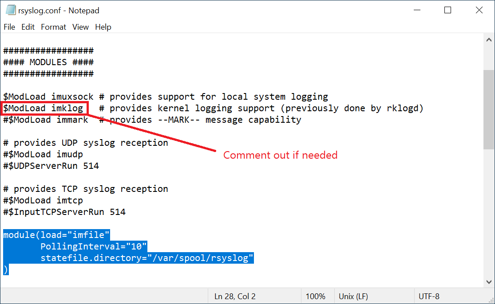
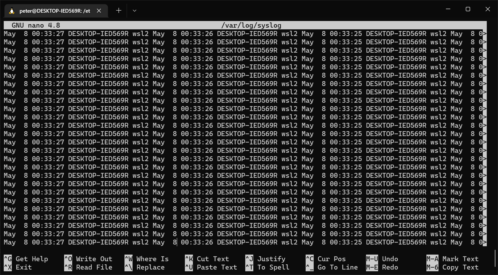
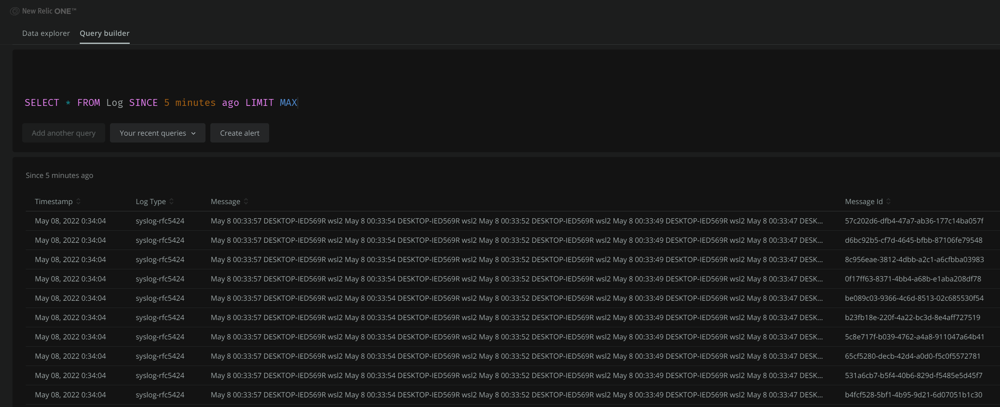

# Install rsyslog (Ubuntu)
```
sudo add-apt-repository ppa:adiscon/v8-stable
sudo apt-get update
sudo apt-get install rsyslog
sudo apt install rsyslog-gnutls ca-certificates
```

# Configure rsyslog

## Add this to `/etc/rsyslog.conf`
```
module(load="imfile"
       PollingInterval="10"
       statefile.directory="/var/spool/rsyslog"
)
```



## Create newrelic.conf
```
sudo touch /etc/rsyslog.d/newrelic.conf
```
Specific the log file to forward to New Relic:
```
input(type="imfile" ruleset="infiles" Tag="docker" File="/var/log/sample.log")
```

Insert your own New Relic INGEST - LICENSE key
```
string="XXXXXXXXXXXXXXXXXXXXXXXXXXXXXXXXXXXXNRAL"
```

## Notes
`imklog` was disabled for Docker image

## Restart rsyslog
sudo service rsyslog stop
sudo service rsyslog start


# Docker
1. Build Docker image:  
```docker build -t pnvnd/newrelic-rsyslog:latest .```

2. Run Docker container interactively:  
```docker run -it -p 514:514 pnvnd/newrelic-rsyslog```

3. If you haven't changed your New Relic INGEST - LICENSE key, do it now

4. Start rsyslog service:  
```rsyslogd```

Don't worry if you see this error, it just means there's no rules to parse the logs so each line goes into the `message` field:
```
rsyslogd: imfile: ruleset 'infiles' for /var/log/sample.log not found - using default ruleset instead [v8.2112.0]
```
Sample logs may look like this:


# New Relic
Log into New Relic and check the logs:
```
SELECT * FROM Log
```
